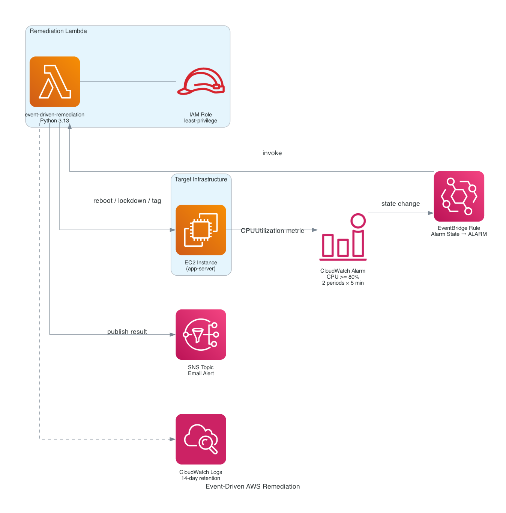

# Event-Driven AWS Remediation

[](https://github.com/jordann6/event-driven-aws-remediation/actions/workflows/validate.yml)

Automated infrastructure remediation triggered by CloudWatch metric alarms. When CPU utilization on the target EC2 instance exceeds 80% for two consecutive 5-minute periods, CloudWatch publishes a state-change event to EventBridge, which invokes a Python Lambda to remediate the instance and notify via SNS — no manual intervention required.

## Architecture



## How It Works

```
EC2 CPUUtilization metric
  → CloudWatch Alarm (>= 80%, 2 × 5 min)
    → EventBridge rule (Alarm State Change → ALARM)
      → Lambda (Python 3.13)
        → EC2 remediation action
        → SNS email notification
        → CloudWatch Logs (14-day retention)
```

## Remediation Actions

The Lambda handles three actions, routed on the `action` field of the incoming event:

| Action | Trigger | What it does |
|---|---|---|
| `reboot` (default) | EventBridge alarm state change | Reboots the target EC2 instance |
| `lockdown_sg` | Manual / additional rule | Revokes all open-world (`0.0.0.0/0`, `::/0`) ingress rules from the security group |
| `enforce_tags` | Manual / additional rule | Applies required tags (`Environment`, `ManagedBy`, `Monitored`) to the instance if missing |

EventBridge alarm events route to `reboot` automatically. Other actions can be triggered by invoking Lambda directly with the appropriate payload.

## Infrastructure

| Resource | Details |
|---|---|
| EC2 | Amazon Linux 2023, `t3.micro` |
| Security Group | Egress-only by default (ingress added only for testing lockdown) |
| CloudWatch Alarm | `CPUUtilization >= 80%`, 2 evaluation periods of 5 minutes |
| EventBridge Rule | Matches `aws.cloudwatch` + alarm name + state `ALARM` |
| Lambda | Python 3.13, env vars: `INSTANCE_ID`, `SG_ID`, `SNS_TOPIC_ARN` |
| IAM Role | Least-privilege: reboot scoped to instance ARN, SG actions scoped, SNS publish scoped to topic |
| SNS Topic | Email subscription for remediation notifications |
| CloudWatch Logs | `/aws/lambda/event-driven-remediation`, 14-day retention |
| Terraform State | S3 backend — `tf-backend-jord-projs` |

## Deploy

```bash
# Authenticate
aws configure  # or use OIDC via GitHub Actions

cd terraform
terraform init
terraform apply \
  -var="vpc_id=vpc-xxxxxxxx" \
  -var="subnet_id=subnet-xxxxxxxx"
```

## Test

The `validate.sh` script runs a five-step end-to-end check: verifies the EC2 instance is running, validates Lambda IAM permissions via `iam simulate-principal-policy`, invokes Lambda with a synthetic alarm payload, tails CloudWatch Logs for the reboot confirmation, and confirms the SNS topic ARN.

```bash
cd terraform
bash ../validate.sh
```

Manual remediation actions:

```bash
LAMBDA=$(terraform output -raw lambda_function_name)

# Trigger security group lockdown
aws lambda invoke \
  --function-name "$LAMBDA" \
  --payload '{"action":"lockdown_sg"}' \
  /tmp/response.json

# Enforce required tags
aws lambda invoke \
  --function-name "$LAMBDA" \
  --payload '{"action":"enforce_tags"}' \
  /tmp/response.json
```

## GitHub Actions Secrets

| Secret | Description |
|---|---|
| `AWS_DEPLOY_ROLE_ARN` | IAM role ARN for OIDC federation |
| `VPC_ID` | VPC ID for EC2 placement |
| `SUBNET_ID` | Subnet ID for EC2 placement |

## Tech Stack

- **Python 3.13** — Lambda runtime
- **boto3** — EC2 reboot, security group revocation, tag enforcement, SNS publish
- **Terraform `>= 1.6`** · `aws ~> 5.0` — all infrastructure as code
- **CloudWatch** — metric alarm, log group
- **EventBridge** — alarm state change routing
- **SNS** — email notification on every remediation
- **GitHub Actions** — OIDC auth, Bandit SAST, pip-audit, terraform validate + apply
